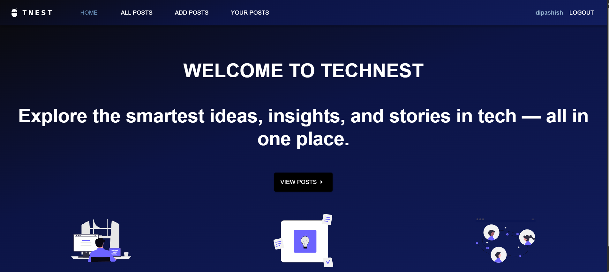
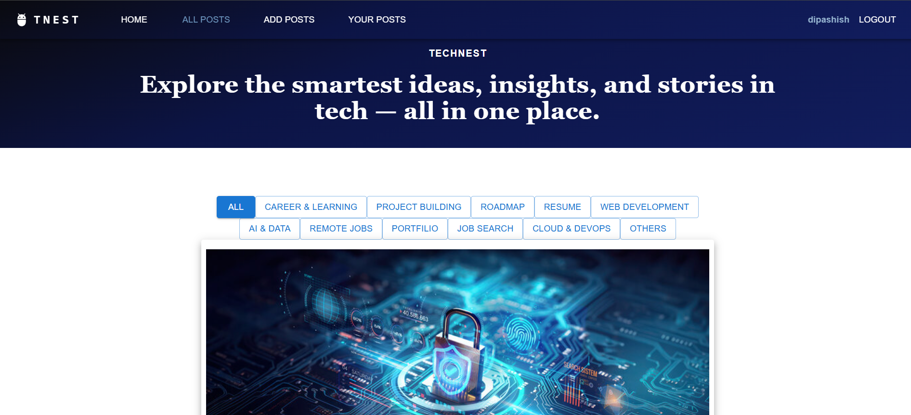
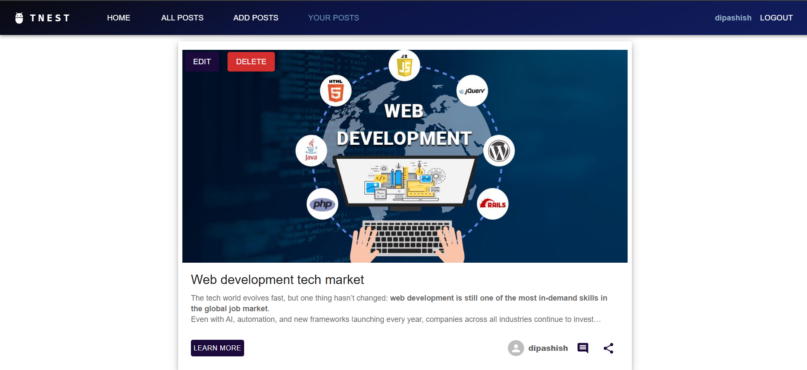
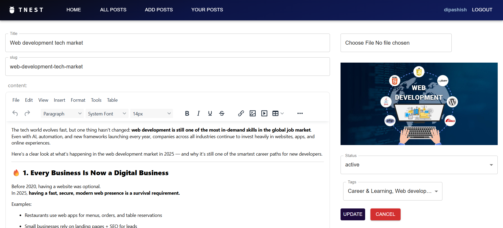
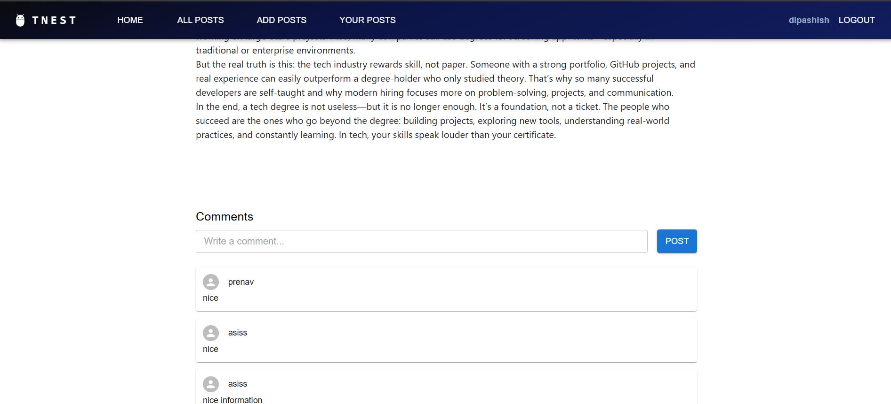

<h1 align="center"> TechNest — A Developer Community Platform</h1>

  <a href="https://tech-nest-btly.vercel.app/" target="_blank" style="font-size:20px; font-weight:bold;">
    🔗 Live Demo — TechNest
  </a>

  TechNest is a modern web platform where developers, tech enthusiasts, and CS students can share insights, articles, ideas, and real-world learning experiences.
   
  <strong>Built from scratch to explore scalable frontend architecture, authenticated workflows, and predictable state management.</strong>

<h2>🚀 Features</h2>

<h3>📝 Full CRUD Posting System</h3>
<ul>
  <li>Create, edit, update, and delete posts</li>
  <li>Rich text editor powered by TinyMCE</li>
  <li>Supports articles, tech notes, roadmaps, tutorials</li>
</ul>

<h3>🔐 Authentication System</h3>
<ul>
  <li>Secure signup & login using Appwrite Auth</li>
  <li>Session handling & persistent user state</li>
</ul>

<h3>🔒 Protected Routes & Role-Based Access</h3>
<ul>
  <li>Unauthorized users cannot access editor/dashboard</li>
  <li>Session validation using Appwrite tokens</li>
  <li>Role logic for authorisation</li>
</ul>

<h3>💬 Comment Discussions</h3>
<ul>
  <li>Each post has a dedicated discussion area</li>
  <li>Users can ask questions, give feedback, and debate topics</li>
</ul>

<h3>🏷️ Tag-Based Filtering</h3>
<ul>
  <li>Browse posts by categories like:</li>
  <ul>
    <li>Web Development</li>
    <li>AI & Data</li>
    <li>Career & Jobs</li>
    <li>Roadmaps</li>
  </ul>
</ul>

<h3>📤 Shareable Post Links</h3>
<ul>
  <li>Users can share article links anywhere (LinkedIn, Discord, etc.)</li>
</ul>

<h3>📱 Fully Responsive UI</h3>
<ul>
  <li>Clean, modern, fully responsive layout</li>
  <li>Built with Material UI</li>
</ul>

<h2>🔧 Engineering Decisions & Learnings</h2>

<ul>
  <li>
    Designed centralized state management using <strong>Redux Toolkit</strong> to avoid prop drilling and ensure predictable updates across authentication, posts, and comments.
  </li>

  <li>
    Implemented <strong>protected routing</strong> with session validation to handle edge cases such as expired sessions, unauthenticated page refreshes, and unauthorized access.
  </li>

  <li>
    Structured <strong>asynchronous data flows</strong> to manage loading, error, and empty states cleanly without blocking the UI.
  </li>

  <li>
    Chose <strong>Appwrite as a Backend-as-a-Service</strong> to focus on frontend architecture while still addressing real-world concerns like authentication, permissions, and data security.
  </li>

  <li>
    Focused on <strong>component reuse and separation of concerns</strong> to keep the codebase maintainable as features and complexity increased.
  </li>
</ul>

<h2>🧩 Tech Stack Used</h2>

<table>
  <tr>
    <td><strong>Frontend Framework</strong></td>
    <td>React.js (Vite)</td>
  </tr>
  <tr>
    <td><strong>UI Library</strong></td>
    <td>Material UI (MUI)</td>
  </tr>
  <tr>
    <td><strong>State Management</strong></td>
    <td>Redux Toolkit</td>
  </tr>
  <tr>
    <td><strong>Routing</strong></td>
    <td>React Router v6</td>
  </tr>
  <tr>
    <td><strong>Authentication</strong></td>
    <td>Appwrite Auth</td>
  </tr>
  <tr>
    <td><strong>Database</strong></td>
    <td>Appwrite Database</td>
  </tr>
  <tr>
    <td><strong>Forms</strong></td>
    <td>React Hook Form</td>
  </tr>
  <tr>
    <td><strong>Rich Text Editor</strong></td>
    <td>TinyMCE Editor</td>
  </tr>
</table>

<h2>📸 Screenshots</h2>

  

  

  

  

  

  

<h2>⚙️ Setup Instructions</h2>

<h3>1️⃣ Clone the repository</h3>
<pre>
git clone https://github.com/DeepAshishThapa/TechNest.git
</pre>
<pre>
cd TechNest
</pre>
<h3>2️⃣ Install dependencies</h3>
<pre>
npm install
</pre>

<h3>3️⃣ Set up environment variables</h3>

Create a <code>.env</code> file in the root:

<pre>
VITE_APPWRITE_PROJECT_ID=xxxx
VITE_APPWRITE_ENDPOINT=https://syd.cloud.appwrite.io/v1
VITE_APPWRITE_DATABASE_ID=xxxx
VITE_APPWRITE_POSTS_COLLECTION_ID=xxxx
VITE_APPWRITE_COMMENTS_COLLECTION_ID=xxxx
VITE_APPWRITE_BUCKET_ID=xxxx
</pre>

<h3>4️⃣ Start development server</h3>
<pre>
npm run dev
</pre>

<h2>📜 License</h2>

This project is open source and available under the MIT License.

<h2>✨ Author</h2>

<strong>Deep Ashish</strong> — Developer & Creator of TechNest

GitHub: <a href="https://github.com/DeepAshishThapa">DeepAshishThapa</a>

