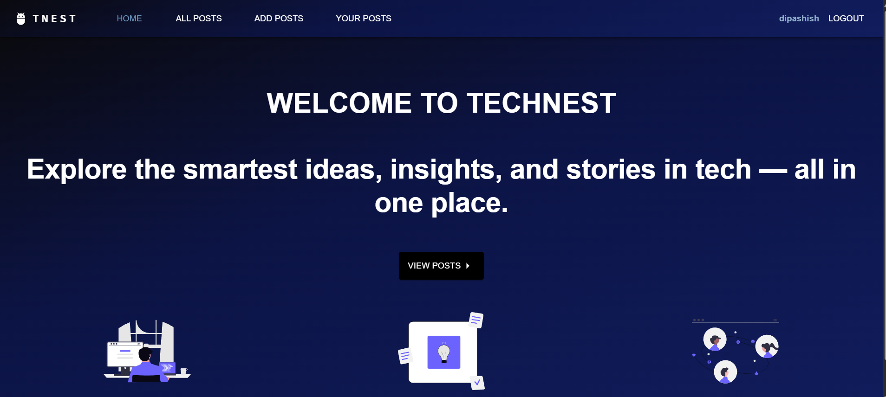
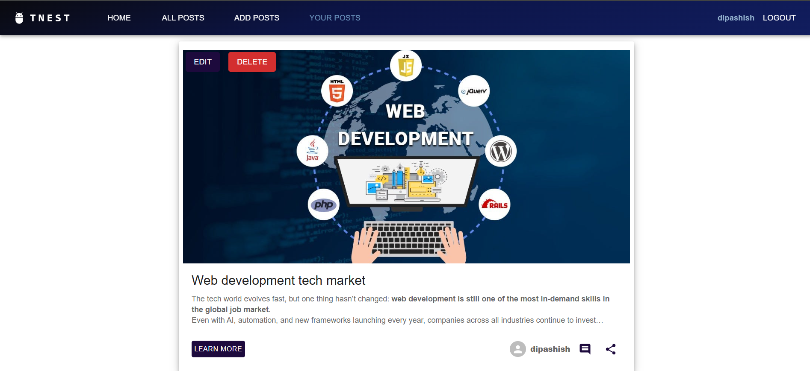
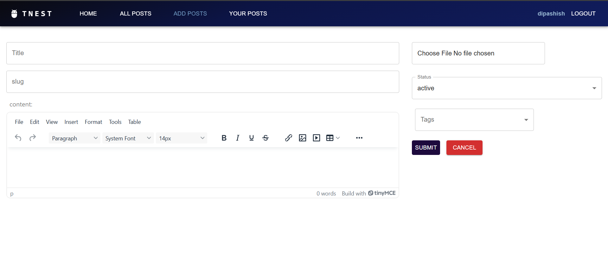
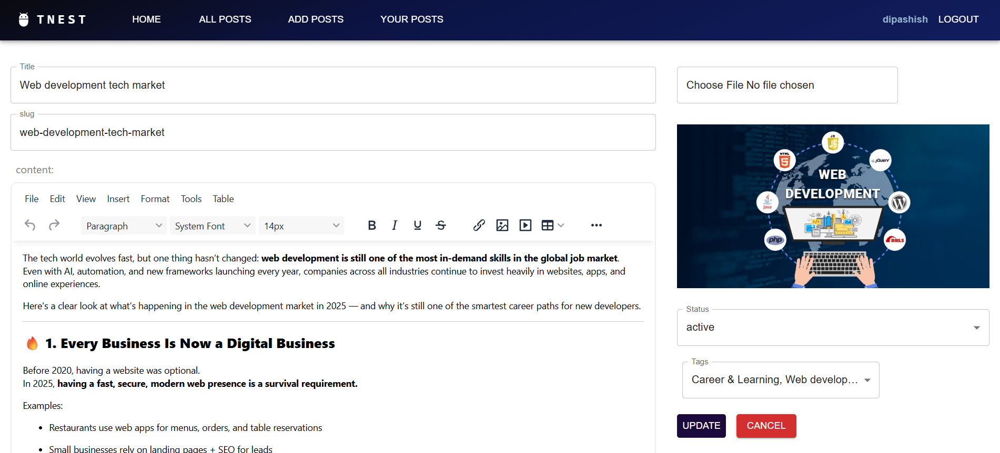
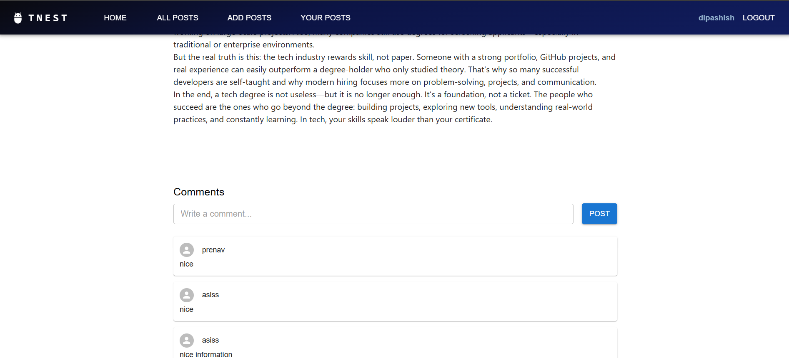

<h1 align="center">🐦 TechNest — A Developer Community Platform</h1>

<p align="center">

  <a href="[https://tech-nest-btly.vercel.app/](https://tech-nest-btly.vercel.app/)" target="_blank">

    🔗 Live Demo — TechNest

  </a>

</p>

<p align="center">

  TechNest is a modern web platform where developers, tech enthusiasts, and CS students can share insights, articles, ideas, and real-world learning experiences.

</p>

<strong>Built entirely from scratch using React, Appwrite, MUI, and Redux Toolkit.</strong>

---

# 🚀 Features

## 📝 Full CRUD Posting System

- Create, edit, update, and delete posts

- Rich text editor powered by TinyMCE

- Supports articles, tech notes, roadmaps, and tutorials

## 🔐 Authentication System

- Secure signup and login using Appwrite Auth

- Session handling and persistent user state

## 🔒 Protected Routes & Role-Based Access

- Unauthorized users cannot access editor/dashboard

- Session validation using Appwrite tokens

- Role logic for authorisation

## 💬 Comment Discussions

- Each post has a dedicated discussion area

- Users can ask questions, give feedback, and debate topics

## 🏷️ Tag-Based Filtering

Browse posts by categories like:

- Web Development

- AI & Data

- Career & Jobs

- Roadmaps

## 📤 Shareable Post Links

Users can share article links anywhere, such as LinkedIn, Discord, etc.

## 📱 Fully Responsive UI

- Clean, modern, fully responsive layout

- Built with Material UI

---

# 🔧 Engineering Decisions & Learnings

- Designed centralized state management using Redux Toolkit to avoid prop drilling and ensure predictable updates across authentication, posts, and comments.

- Implemented protected routing with session validation to handle edge cases such as expired sessions, unauthenticated page refreshes, and unauthorized access.

- Structured asynchronous data flows to manage loading, error, and empty states cleanly without blocking the UI.

- Chose Appwrite as a Backend-as-a-Service to focus on frontend architecture while still addressing real-world concerns like authentication, permissions, and data security.

- Focused on component reuse and separation of concerns to keep the codebase maintainable as features and complexity increased.

---

# 🧩 Tech Stack Used

| Category | Technology |

|---|---|

| Frontend Framework | React.js (Vite) |

| UI Library | Material UI (MUI) |

| State Management | Redux Toolkit |

| Routing | React Router v6 |

| Authentication | Appwrite Auth |

| Database | Appwrite Database |

| Forms | React Hook Form |

| Rich Text Editor | TinyMCE Editor |

---

# 📂 Folder Structure

```txt

technest/

│── public/

│── src/

│   ├── app/

│   │   └── store.js

│   ├── auth/

│   │   ├── Login.jsx

│   │   ├── Signup.jsx

│   ├── components/

│   │   ├── Navbar.jsx

│   │   ├── Footer.jsx

│   ├── pages/

│   │   ├── Home.jsx

│   │   ├── AllPosts.jsx

│   │   ├── PostDetails.jsx

│   │   ├── CreatePost.jsx

│   │   ├── EditPost.jsx

│   ├── features/

│   ├── utils/

│   ├── hooks/

│   └── main.jsx

```

---

# 📸 Screenshots

  
  
  
  
  
  







---

# ⚙️ Setup Instructions

## 1️⃣ Clone the repository

```bash

git clone [https://github.com/DeepAshishThapa/TechNest.git](https://github.com/DeepAshishThapa/TechNest.git)

cd TechNest

```

## 2️⃣ Install dependencies

```bash

npm install

```

## 3️⃣ Set up environment variables

Create a `.env` file in the root:

```env

VITE_APPWRITE_PROJECT_ID=xxxx

VITE_APPWRITE_ENDPOINT=[https://syd.cloud.appwrite.io/v1](https://syd.cloud.appwrite.io/v1)

VITE_APPWRITE_DATABASE_ID=xxxx

VITE_APPWRITE_POSTS_COLLECTION_ID=xxxx

VITE_APPWRITE_COMMENTS_COLLECTION_ID=xxxx

VITE_APPWRITE_BUCKET_ID=xxxx

```

## 4️⃣ Start development server

```bash

npm run dev

```

---

# 📜 License

This project is open source and available under the MIT License.

---

# ✨ Author

Deep Ashish — Developer & Creator of TechNest

GitHub: DeepAshishThapa